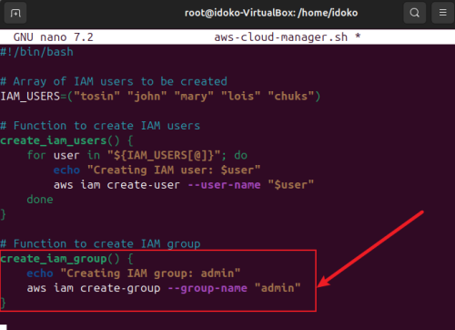

# AWS IAM Management Script

## Introduction
**Overview:** This project focuses on developing an automated shell script to manage AWS Identity and Access Management (IAM) resources using the AWS Command Line Interface (CLI). The script automates the creation of IAM users, IAM groups, and the attachment of an administrative policy. This process is essential for efficiently onboarding new employees and ensuring secure access to AWS resources.

## Objective: 

The primary objective of this project is to:

- Create IAM users for five new employees.
- Create an admin IAM group.
- Attach the AWS-managed policy AdministratorAccess to the group.
- Assign the users to the admin group, thereby granting them administrative permissions.

This document details the script development process, including environment setup, script functionality, testing procedures, and how to execute the script.

## Environment Setup

Before running the script, certain prerequisites must be met to ensure proper execution and testing.

**AWS CLI Installation and Configuration**

To interact with AWS services from the command line, you need to install and configure the AWS CLI. Follow the steps below to set it up:

1. **Install the AWS CLI:**

    - The AWS CLI can be installed on various operating systems (Windows, macOS, Linux). Follow the AWS documentation for your system: **AWS CLI Installation Guide.**

2. **Configure the AWS CLI:**

    - After installation, configure the AWS CLI with your AWS credentials and default region. Use the following command to set up: `aws configure`

    - Provide the following information:
        - AWS Access Key ID: Your access key for the IAM user.
        - AWS Secret Access Key: The secret access key for your IAM user
        - Default region name: The region where the resources will be created (e.g., us-east-1).
        - Default output format: Usually set to json or text.

        

3. **Ensure Required Permissions:**

    - The IAM user running the script must have permissions to manage IAM resources (users, groups, and policies). Assign the AdministratorAccess policy to the user, or ensure the user has permissions to execute the following actions:

        - iam:CreateUser
        - iam:CreateGroup
        - iam:AttachGroupPolicy
        - iam:AddUserToGroup
    
    

4. Verify AWS CLI Connectivity

    

    This will return your account ID and IAM user or role information. Verify that this is the correct AWS account where you expect to see the users.

## aws_cloud_manager.sh - Shell Script

**Objective:** Write script to automate the creation and management of IAM resources for five new employees.

1. **Define IAM User Array**

    - In your script, you will define an array of IAM usernames for easy iteration when creating users.

    
    

2. **Function to Create IAM Users**

    - The aws iam create-user command will be used to create IAM users. This is where you'll loop through the IAM_USERS array and create users.

    

3. **Create IAM Group**

    - Use the aws iam create-group command to create an IAM group named admin.

    

4. **Attach Administrative Policy to Group**

    - To give the group administrative privileges, use the aws iam attach-group-policy command with the AdministratorAccess policy.

    

5. **Assign IAM Users to Group**
    - To assign the created IAM users to the admin group, use the aws iam add-user-to-group command in a loop.

    

6. **Execute functions in sequence**

    

7. Running the Script

    - You can run the script from your terminal using Git Bash or directly in any shell-supported environment: `./aws_cloud_manager.sh`

    **OUTPUT:**
    

    

    

8. Testing and Verification

    - Check the IAM users in the AWS Management Console or by using: `aws iam list-users`

    **By using `aws iam list-users`:**
    

    **By using AWS Management Console:**

    

    

## Conclusion

This script leverages the AWS CLI to automate the management of IAM resources. It helps efficiently onboard new users, assign them to an administrative group, and apply policies, all through a shell script.
